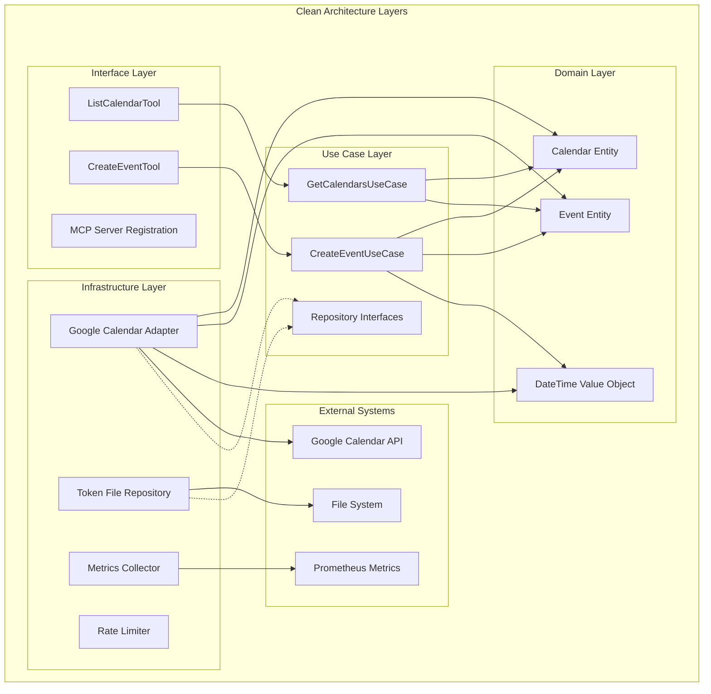
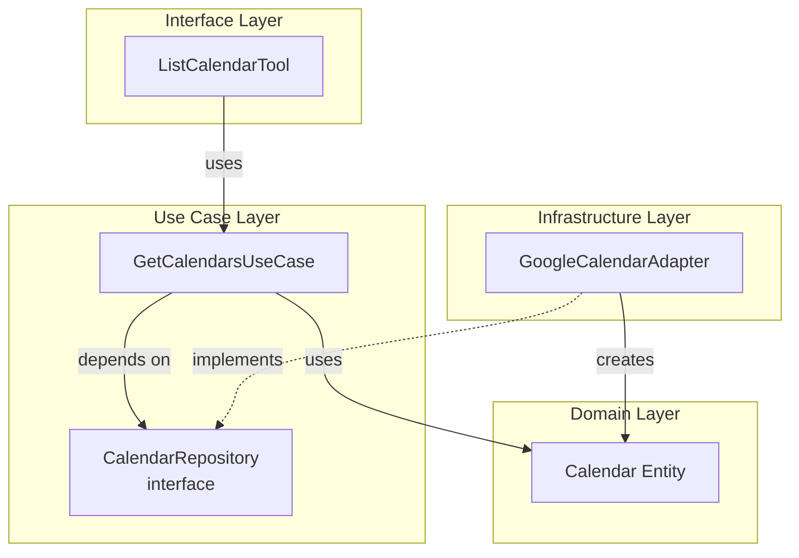
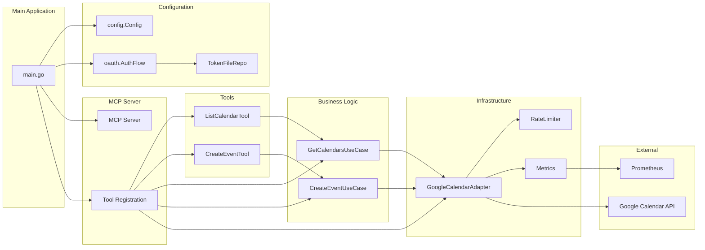
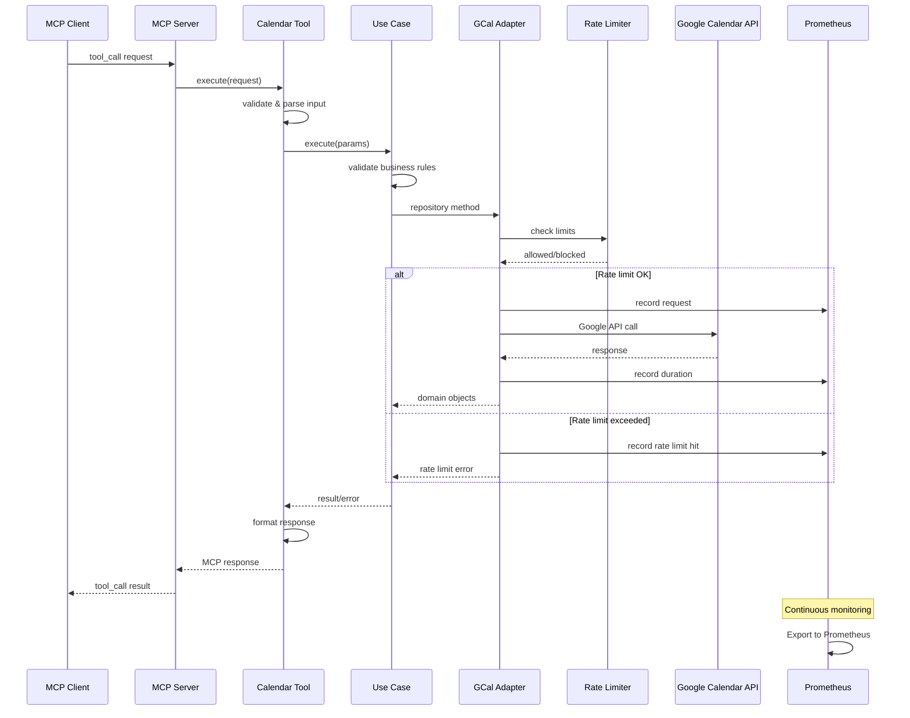
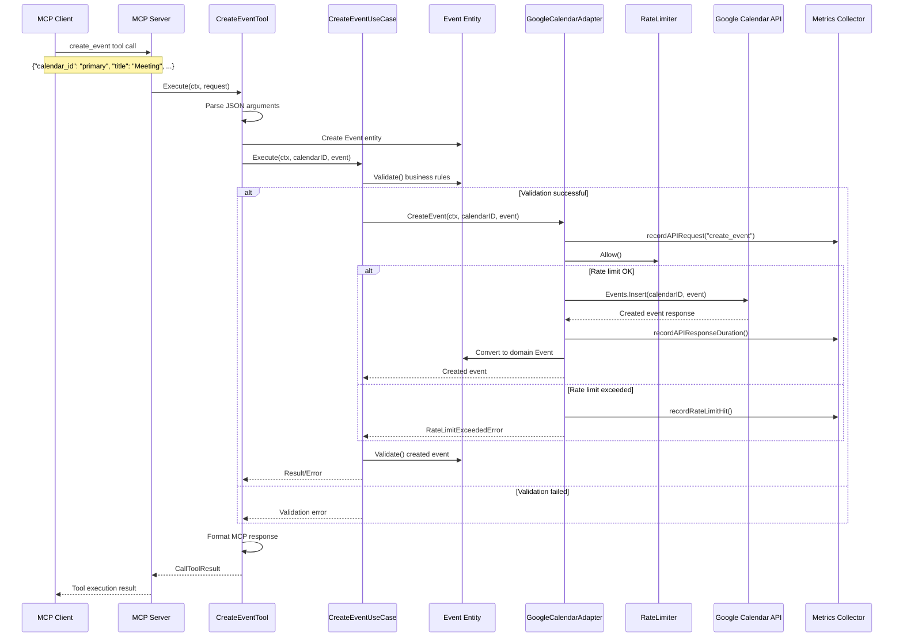

# MCP Google Calendar - Architecture Documentation

## Overview

The MCP Google Calendar project implements a Model Context Protocol (MCP) server that provides Google Calendar integration using Clean Architecture principles. The system is built in Go and follows Domain-Driven Design (DDD) patterns with clear separation of concerns across multiple architectural layers.

## Directory Structure Analysis

```
mcp-google-calendar/
├── cmd/                          # Application entry points
│   └── server/                   # Main server application
├── internal/                     # Internal application code
│   ├── domain/                   # Domain layer (entities, value objects)
│   ├── usecase/                  # Use case layer (business logic)
│   ├── interfaces/               # Interface layer (MCP tools, adapters)
│   └── infrastructure/           # Infrastructure layer (external systems)
│       ├── gcal/                 # Google Calendar API adapter
│       └── repository/           # Data persistence
└── pkg/                          # Public packages
    ├── config/                   # Configuration management
    └── errors/                   # Error definitions
```

## Clean Architecture Implementation

The project follows Clean Architecture with four distinct layers:

### 1. Domain Layer (`internal/domain/`)
- **Entities**: `Calendar`, `Event`
- **Value Objects**: `DateTime`
- **Business Rules**: Validation logic embedded in entities
- **Zero Dependencies**: No external dependencies

### 2. Use Case Layer (`internal/usecase/`)
- **Use Cases**: `CreateEventUseCase`, `GetCalendarsUseCase`
- **Repository Interfaces**: `EventRepository`, `CalendarRepository`
- **Business Logic**: Input validation and orchestration
- **Dependencies**: Only depends on domain layer

### 3. Interface Layer (`internal/interfaces/`)
- **MCP Tools**: `ListCalendarTool`, `CreateEventTool`
- **Tool Registration**: `RegisterCalendarTools`
- **Input/Output Conversion**: JSON marshaling/unmarshaling
- **Dependencies**: Domain and use case layers

### 4. Infrastructure Layer (`internal/infrastructure/`)
- **External APIs**: Google Calendar API adapter
- **Persistence**: Token file repository
- **Cross-cutting Concerns**: Rate limiting, metrics, error handling
- **Dependencies**: Domain layer (implements interfaces)

## Architecture Diagrams

### Layer Architecture Diagram



#### Example Use Case and Interface Interaction



### Component Dependency Diagram



### Data Flow Diagram



### Sequence Diagram - Create Event Flow



## Key Design Decisions and Rationale

### 1. Clean Architecture Pattern
- **Decision**: Implement Clean Architecture with clear layer boundaries
- **Rationale**: 
  - Separation of concerns for maintainability
  - Testability through dependency injection
  - Independence from external frameworks
  - Business logic isolation

### 2. Domain-Driven Design (DDD)
- **Decision**: Use domain entities with embedded validation
- **Rationale**:
  - Business rules are centralized in domain objects
  - Rich domain model prevents invalid states
  - Clear ubiquitous language across the application

### 3. Repository Pattern
- **Decision**: Abstract external dependencies through interfaces
- **Rationale**:
  - Testability through mock implementations
  - Flexibility to change external services
  - Clear contracts between layers

### 4. Metrics and Monitoring
- **Decision**: Implement Prometheus metrics throughout the infrastructure layer
- **Rationale**:
  - Observability for production systems
  - Performance monitoring and alerting
  - API quota management

### 5. Rate Limiting
- **Decision**: Implement client-side rate limiting for Google Calendar API
- **Rationale**:
  - Prevent API quota exhaustion
  - Graceful handling of rate limits
  - Improved reliability

### 6. Error Handling Strategy
- **Decision**: Custom error types with context information
- **Rationale**:
  - Detailed error reporting for debugging
  - Proper error categorization
  - Error wrapping for context preservation

### 7. Configuration Management
- **Decision**: Environment-based configuration with validation
- **Rationale**:
  - Security for sensitive credentials
  - Environment-specific deployments
  - Early validation of configuration

### 8. OAuth Token Management
- **Decision**: File-based token storage with automatic refresh
- **Rationale**:
  - Persistent authentication sessions
  - Security through file permissions
  - Simplified deployment

## Dependencies and Data Flow

### External Dependencies
- **Google Calendar API**: Primary integration target
- **MCP Protocol**: Communication framework
- **OAuth2**: Authentication mechanism
- **Prometheus**: Metrics collection
- **File System**: Token persistence

### Internal Dependencies
- Domain layer: No dependencies (core business logic)
- Use case layer: Depends only on domain
- Interface layer: Depends on use case and domain
- Infrastructure layer: Implements use case interfaces

### Cross-Cutting Concerns
- **Logging**: Structured logging with slog
- **Metrics**: Prometheus metrics collection
- **Error Handling**: Custom error types with context
- **Rate Limiting**: Google API quota management
- **Configuration**: Environment-based setup

## Current Implementation Status

### Completed Features
- ✅ Clean Architecture implementation
- ✅ Domain entities with validation
- ✅ Use case orchestration
- ✅ Google Calendar API integration
- ✅ OAuth2 authentication flow
- ✅ Rate limiting implementation
- ✅ Prometheus metrics
- ✅ MCP tool registration
- ✅ Error handling framework
- ✅ Configuration management
- ✅ Token persistence

### Key Capabilities
1. **List Calendars**: Retrieve user's available calendars
2. **Create Events**: Create new calendar events with validation
3. **Rate Limiting**: Prevent API quota exhaustion
4. **Metrics**: Monitor API usage and performance
5. **Error Handling**: Comprehensive error reporting
6. **Authentication**: OAuth2 flow with token refresh

### Testing Coverage
- Unit tests for domain entities
- Use case testing with mocks
- Infrastructure component testing
- Configuration validation testing

## Future Enhancement Opportunities

1. **Additional MCP Tools**: Update events, delete events, list events
2. **Caching Layer**: Reduce API calls for frequently accessed data
3. **Batch Operations**: Support for bulk event operations
4. **Event Subscriptions**: Real-time calendar change notifications
5. **Multi-calendar Support**: Enhanced calendar management features
6. **Configuration UI**: Web interface for easier setup

This architecture provides a solid foundation for a maintainable, testable, and extensible Google Calendar MCP server while following industry best practices for Go applications.